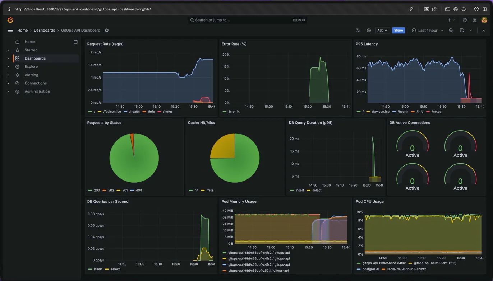
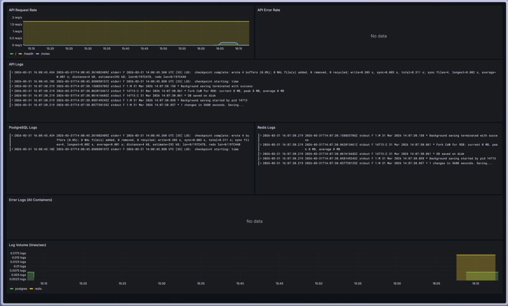

# GitOps on EKS with ArgoCD, Helm, and Full Observability

A GitOps-driven Kubernetes deployment on Amazon EKS with a complete observability stack, metrics, logs, dashboards, and alerting. Push to `main` and ArgoCD automatically syncs everything. Git is the single source of truth.


## What This Project Demonstrates

- **GitOps workflow**: ArgoCD watches GitHub and auto-syncs changes to EKS
- **Helm chart authoring**: Custom chart with Deployments, StatefulSets, Services, Ingress, ConfigMap, Secrets
- **EKS cluster provisioning**: Terraform modules for VPC + EKS with managed node groups
- **Kubernetes-native databases**: PostgreSQL (StatefulSet + PVC) and Redis running as pods
- **AWS integrations**: Load Balancer Controller (ALB from Ingress), EBS CSI Driver, ECR, IRSA
- **Application instrumentation**: Custom Prometheus metrics (counters, histograms, gauges)
- **Metrics dashboards**: 9-panel Grafana dashboard covering HTTP, database, cache, and infrastructure metrics
- **Log aggregation**: Loki + Promtail collecting container logs, queryable via LogQL
- **Metric-to-log correlation**: Combined dashboard with metrics and logs side by side — click a spike, see the logs
- **Custom alerting**: 9 PrometheusRule alerts for API health, database performance, cache efficiency, and pod stability
- **Monitoring as code**: Full observability stack (Prometheus, Grafana, Loki, Promtail, Alertmanager) deployed via GitOps

## Architecture

```
Developer → git push → GitHub repo
                          ↓ (polls every 3m)
                       ArgoCD (auto-sync + self-heal)
                          ↓ (helm sync)
┌──────────────────────────────────────────────────────────┐
│  EKS Cluster (3x t3.medium managed nodes)                │
│                                                          │
│  ┌── namespace: three-tier ───────────────────────────┐  │
│  │  Ingress (ALB) → gitops-api (2 replicas, /metrics) │  │
│  │                       ↓              ↓              │  │
│  │               PostgreSQL (PVC)    Redis              │  │
│  └─────────────────────────────────────────────────────┘  │
│                                                          │
│  ┌── namespace: monitoring ───────────────────────────┐  │
│  │  Prometheus ──ServiceMonitor──→ gitops-api          │  │
│  │      │       ──scrapes──→ Node Exporter             │  │
│  │      │       ──scrapes──→ kube-state-metrics        │  │
│  │      ↓                                              │  │
│  │  Alertmanager → Email notifications                 │  │
│  │                                                     │  │
│  │  Promtail (DaemonSet) → tails /var/log/pods         │  │
│  │      ↓                                              │  │
│  │  Loki → stores & indexes logs                       │  │
│  │                                                     │  │
│  │  Grafana (2 custom dashboards)                      │  │
│  │    • GitOps API Dashboard (9 metric panels)         │  │
│  │    • Logs & Metrics Correlation (7 panels)          │  │
│  └─────────────────────────────────────────────────────┘  │
│                                                          │
│  ┌── namespace: argocd ──────────────────────────────┐   │
│  │  ArgoCD Server (manages all deployments via Git)   │  │
│  └────────────────────────────────────────────────────┘  │
└──────────────────────────────────────────────────────────┘

Developer → docker push → ECR (pulled by EKS nodes)
Users → HTTP :80 → ALB → gitops-api pods :3000
```

## GitOps Workflow

1. Developer changes Helm values, app code, monitoring configs, or alert rules
2. Pushes to `main` branch on GitHub
3. ArgoCD detects the change within 3 minutes
4. ArgoCD syncs the diff to the EKS cluster
5. Kubernetes rolls out updated pods with zero downtime

Four ArgoCD applications manage the entire stack:
- `three-tier-app` — the application (Helm chart)
- `monitoring-stack` — kube-prometheus-stack (Helm chart from upstream)
- `loki-stack` — Loki + Promtail (Helm chart from upstream)
- `monitoring-custom` — custom alerts and Grafana dashboards (raw manifests)

## Tech Stack

| Component | Technology | Details |
|-----------|-----------|---------|
| Cluster | Amazon EKS 1.29 | Managed control plane |
| Compute | Managed Node Group | 2x t3.medium in private subnets |
| GitOps | ArgoCD | Auto-sync + self-heal |
| Packaging | Helm 3 | Custom chart, 8 templates |
| Ingress | AWS LB Controller | ALB from Ingress resource |
| Application | Bun + Express | Notes API with CRUD + caching + /metrics |
| Database | PostgreSQL 16 | StatefulSet with 1Gi EBS PVC |
| Cache | Redis 7 | Deployment with LRU eviction |
| Metrics | Prometheus + prom-client | ServiceMonitor, 7 custom metrics |
| Logs | Loki + Promtail | DaemonSet log collection, LogQL queries |
| Dashboards | Grafana | 9-panel metrics + 7-panel logs dashboard |
| Alerting | Alertmanager + PrometheusRules | 9 custom alerts |
| Node metrics | Node Exporter | CPU, memory, disk, network |
| K8s metrics | kube-state-metrics | Pod status, deployments, replicas |
| Storage | EBS CSI Driver | Dynamic PV provisioning |
| Registry | Amazon ECR | Container image scanning |
| IaC | Terraform | 2 modules (VPC + EKS), 27 resources |
| Auth | IRSA + OIDC | Pod-level IAM via service accounts |

## Grafana Dashboard



9 panels covering every layer of the application:

| Panel | What It Shows |
|-------|---------------|
| Request Rate | Requests per second by route (/, /health, /info, /notes) |
| Error Rate | Percentage of 5xx responses over time |
| P95 Latency | 95th percentile response time by route |
| Requests by Status | Pie chart: 200, 201, 404, 503 distribution |
| Cache Hit/Miss | Pie chart: Redis cache hits vs misses |
| DB Query Duration | p95 latency for inserts vs selects |
| DB Active Connections | Gauge per pod (0-10 scale) |
| DB Queries/s | Insert and select operations per second |
| Pod Memory + CPU | Resource usage per pod and container |

## Logs & Metrics Correlation Dashboard



7 panels combining Prometheus metrics with Loki logs:

| Panel | Datasource | What It Shows |
|-------|-----------|---------------|
| API Request Rate | Prometheus | Requests per second by route |
| API Error Rate | Prometheus | Percentage of 5xx responses |
| API Logs | Loki | Live log stream from gitops-api containers |
| PostgreSQL Logs | Loki | Database checkpoint, connection, and startup logs |
| Redis Logs | Loki | Cache operations and background save logs |
| Error Logs | Loki | Filtered for error/fail/panic/crash across all containers |
| Log Volume | Loki | Lines per second per container |

**The workflow**: See a spike in the metrics panels at the top → drag to select that time range → log panels below update to show logs from that exact window → root cause in under 2 minutes.

## LogQL Queries

```
# All logs from the app namespace
{namespace="three-tier"}

# Just API container logs
{namespace="three-tier", container="gitops-api"}

# Filter for errors
{namespace="three-tier"} |~ "(?i)(error|fail|panic|crash|exception)"

# Log volume as a metric (lines/sec)
sum(rate({namespace="three-tier"}[5m])) by (container)
```

## Custom Metrics

The API exposes `/metrics` scraped by Prometheus every 15 seconds via ServiceMonitor:

| Metric | Type | Description |
|--------|------|-------------|
| `http_requests_total` | Counter | Requests by method, route, status |
| `http_request_duration_seconds` | Histogram | Latency with p50/p95/p99 buckets |
| `db_queries_total` | Counter | Queries by operation and status |
| `db_query_duration_seconds` | Histogram | Query latency by operation |
| `db_active_connections` | Gauge | Active connections in the pool |
| `cache_operations_total` | Counter | Cache ops by type and result |
| `app_info` | Gauge | Version, pod name, runtime |

## Alert Rules

| Alert | Severity | Condition |
|-------|----------|-----------|
| APIHighErrorRate | Critical | 5xx rate > 5% for 2 min |
| APIHighLatency | Warning | p95 > 1s for 5 min |
| APIDown | Critical | Metrics endpoint unreachable for 1 min |
| DatabaseHighErrorRate | Critical | Query error rate > 1% for 2 min |
| DatabaseSlowQueries | Warning | p95 query time > 500ms for 5 min |
| DatabaseConnectionPoolExhausted | Warning | Active connections > 8/10 for 2 min |
| CacheHighMissRate | Warning | Miss rate > 80% for 10 min |
| PodCrashLooping | Critical | > 3 restarts in 15 min |
| PodHighMemory | Warning | Memory > 85% of limit for 5 min |

## Project Structure

```
├── app/
│   ├── src/
│   │   ├── app.js          # Express routes with metric instrumentation
│   │   ├── server.js        # Entry point with DB init
│   │   └── metrics.js       # prom-client: counters, histograms, gauges, middleware
│   ├── Dockerfile
│   └── package.json
├── helm/
│   └── three-tier-app/
│       ├── Chart.yaml
│       ├── values.yaml
│       └── templates/
│           ├── namespace.yaml
│           ├── configmap.yaml
│           ├── secret.yaml
│           ├── deployment.yaml   # 2 replicas, configmap checksum annotation
│           ├── service.yaml      # Named port for ServiceMonitor
│           ├── ingress.yaml      # ALB via AWS LB Controller
│           ├── postgres.yaml     # StatefulSet + headless Service
│           └── redis.yaml        # Deployment + Service
├── monitoring/
│   ├── servicemonitor.yaml                    # Prometheus ServiceMonitor
│   ├── loki-datasource.yaml                   # Loki datasource for Grafana
│   ├── alerts/
│   │   └── gitops-api-alerts.yaml             # 9 PrometheusRule alerts
│   └── dashboards/
│       ├── grafana-dashboard-configmap.yaml    # 9-panel metrics dashboard
│       └── logs-dashboard-configmap.yaml       # 7-panel logs correlation dashboard
├── argocd/
│   ├── application.yaml          # Three-tier app
│   ├── monitoring-stack.yaml     # kube-prometheus-stack
│   ├── loki-stack.yaml           # Loki + Promtail
│   └── monitoring-custom.yaml    # Custom alerts + dashboards
├── terraform/
│   ├── main.tf
│   ├── variables.tf
│   ├── outputs.tf
│   ├── terraform.tfvars
│   └── modules/
│       ├── vpc/             # VPC, subnets, NAT GW, K8s tags
│       └── eks/             # Cluster, node group, OIDC, IRSA
└── docs/
    ├── architecture.png
    └── grafana-dashboard.png
```

## API Endpoints

| Endpoint | Description |
|----------|-------------|
| `GET /` | Welcome message with pod name and version |
| `GET /health` | DB + Redis connectivity check |
| `GET /info` | Pod name, version, uptime, runtime |
| `GET /metrics` | Prometheus metrics (scraped by ServiceMonitor) |
| `GET /notes` | List notes (cached in Redis 30s) |
| `POST /notes` | Create note `{ title, content }` — invalidates cache |
| `DELETE /notes/:id` | Delete note — invalidates cache |

## Deploying from Scratch

### Prerequisites

- AWS CLI, kubectl, Helm 3, Docker, eksctl, Terraform >= 1.5.0

### Step 1: Provision Infrastructure

```bash
cd terraform/
terraform init && terraform apply
aws eks update-kubeconfig --region us-east-1 --name gitops-eks
```

### Step 2: Install EBS CSI Driver

```bash
eksctl create iamserviceaccount \
  --name ebs-csi-controller-sa --namespace kube-system \
  --cluster gitops-eks --role-name gitops-eks-ebs-csi-role \
  --attach-policy-arn arn:aws:iam::aws:policy/service-role/AmazonEBSCSIDriverPolicy \
  --approve

aws eks create-addon --cluster-name gitops-eks --addon-name aws-ebs-csi-driver \
  --service-account-role-arn arn:aws:iam::$(aws sts get-caller-identity --query Account --output text):role/gitops-eks-ebs-csi-role \
  --resolve-conflicts OVERWRITE
```

### Step 3: Install AWS Load Balancer Controller

```bash
kubectl apply -f https://github.com/cert-manager/cert-manager/releases/download/v1.14.5/cert-manager.yaml
kubectl wait --for=condition=Available --timeout=120s -n cert-manager deployment/cert-manager-webhook

helm repo add eks https://aws.github.io/eks-charts && helm repo update
helm install aws-load-balancer-controller eks/aws-load-balancer-controller \
  -n kube-system --set clusterName=gitops-eks \
  --set serviceAccount.create=true \
  --set "serviceAccount.annotations.eks\.amazonaws\.io/role-arn=$(cd terraform && terraform output -raw lb_controller_role_arn)"
```

### Step 4: Install ArgoCD

```bash
kubectl create namespace argocd
kubectl apply -n argocd -f https://raw.githubusercontent.com/argoproj/argo-cd/stable/manifests/install.yaml --server-side=true --force-conflicts
kubectl wait --for=condition=Available --timeout=300s -n argocd deployment/argocd-server
```

### Step 5: Build and Push App

```bash
cd app/ && bun install
docker build --platform linux/amd64 -t gitops-api .
aws ecr get-login-password --region us-east-1 | docker login --username AWS --password-stdin $(aws sts get-caller-identity --query Account --output text).dkr.ecr.us-east-1.amazonaws.com
docker tag gitops-api:latest $(cd ../terraform && terraform output -raw ecr_repository_url):latest
docker push $(cd ../terraform && terraform output -raw ecr_repository_url):latest
```

### Step 6: Deploy Everything

```bash
kubectl apply -f argocd/application.yaml
kubectl apply -f argocd/monitoring-stack.yaml
kubectl apply -f argocd/loki-stack.yaml
kubectl apply -f argocd/monitoring-custom.yaml
```

### Step 7: Access

```bash
# App
ALB=$(kubectl get ingress -n three-tier -o jsonpath='{.items[0].status.loadBalancer.ingress[0].hostname}')
curl $ALB/health

# Grafana
kubectl port-forward svc/monitoring-stack-grafana -n monitoring 3000:80
# http://localhost:3000 — admin / grafana-admin-2026

# ArgoCD
kubectl port-forward svc/argocd-server -n argocd 8080:443
# https://localhost:8080
```

### Tear Down

```bash
kubectl delete application monitoring-custom monitoring-stack loki-stack three-tier-app -n argocd
cd terraform/ && terraform destroy
```

## Lessons Learned

**ServiceMonitor > additionalScrapeConfigs.** The Prometheus operator manages config through CRDs. A ServiceMonitor with label selectors is the Kubernetes-native approach and works immediately. Raw scrape configs were unreliable.

**Services need named ports for ServiceMonitor.** `port: 80` isn't enough — you need `name: http, port: 80`. The ServiceMonitor references ports by name, and without it Prometheus silently ignores the target.

**EBS CSI Driver OIDC must match the current cluster.** Destroying and recreating an EKS cluster changes the OIDC provider URL. IAM roles from the old cluster fail with `Not authorized to perform sts:AssumeRoleWithWebIdentity`. Delete and recreate the IAM service account.

**IRSA annotations can go blank after Helm reinstall.** Always verify with `kubectl get sa -o yaml`. Use `kubectl annotate --overwrite` to fix.

**ArgoCD CRDs require server-side apply.** Use `--server-side=true --force-conflicts` when installing ArgoCD manifests.

**Helm indentation errors show as Unknown sync.** A single wrong indent causes ArgoCD to show `Unknown` status with a `ComparisonError`. Check `kubectl describe application` for the actual error.

**ConfigMap changes don't restart pods.** Add a checksum annotation to the deployment template so pods roll out automatically when config changes.

**t3.medium has a pod limit of ~17.** A full observability stack (Prometheus, Grafana, Alertmanager, Node Exporter, kube-state-metrics, Loki, Promtail) plus the app, ArgoCD, cert-manager, and LB controller can exhaust two nodes. Scale to 3 nodes when running the full stack.

**Grafana sidecar provisioning can be unreliable.** If datasources or dashboards aren't picked up after restarts, add them manually through the UI. The dashboards are what matter, not how the datasource was configured.

**Dashboard JSON imports can corrupt quotes.** Curly/smart quotes break PromQL and LogQL queries silently. Always type queries manually in the panel editor rather than relying on imported JSON.

## Cost Considerations

| Resource | Estimated Monthly Cost |
|----------|----------------------|
| EKS Control Plane | $73 |
| 3x t3.medium nodes | $90 |
| NAT Gateway | $32 |
| ALB (via Ingress) | $16 |
| Prometheus EBS (10Gi) | $1 |
| Loki EBS (10Gi) | $1 |
| Postgres EBS (1Gi) | $0.10 |
| Monitoring pods | Minimal (existing nodes) |
| **Total** | **~$213/month** |

Use `terraform destroy` when not actively working.
