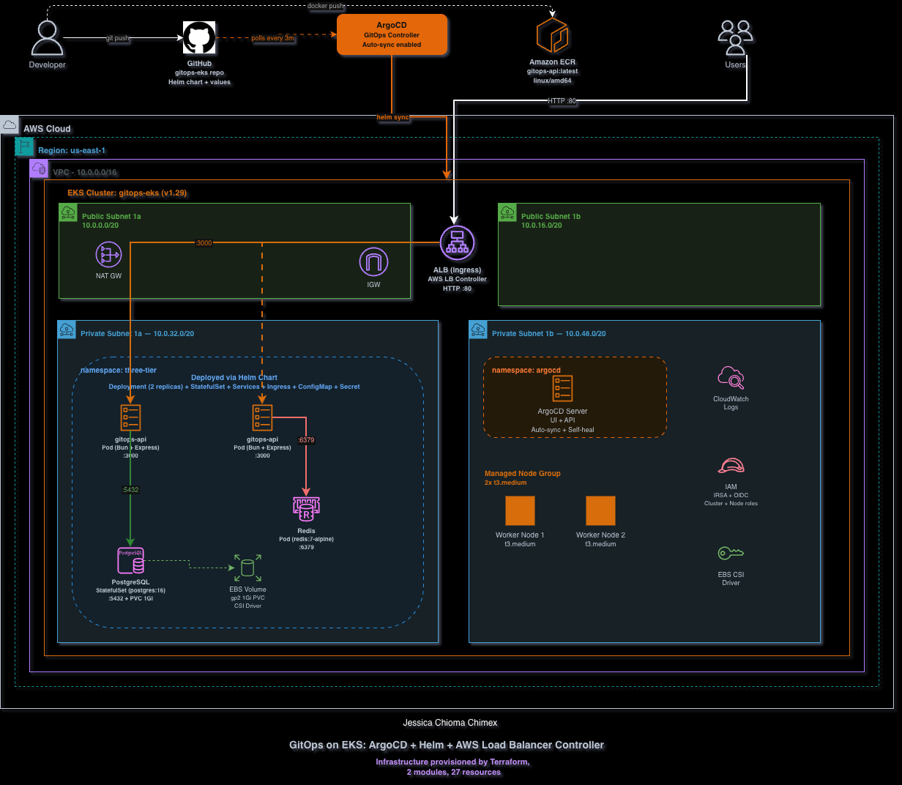

# GitOps on EKS with ArgoCD and Helm

A fully GitOps-driven Kubernetes deployment on Amazon EKS. Push to `main` and ArgoCD automatically syncs a Helm chart deploying a 3-tier application (API + PostgreSQL + Redis) to the cluster. No `kubectl apply`, no manual deployments — Git is the single source of truth.



## What This Project Demonstrates

- **GitOps workflow**: ArgoCD watches a GitHub repo and auto-syncs changes to EKS
- **Helm chart authoring**: Custom chart with Deployment, StatefulSet, Services, Ingress, ConfigMap, and Secrets
- **EKS cluster provisioning**: Terraform modules for VPC + EKS with managed node groups
- **Kubernetes-native databases**: PostgreSQL (StatefulSet + PVC) and Redis running as pods
- **AWS Load Balancer Controller**: Ingress resource automatically provisions an internet-facing ALB
- **IRSA (IAM Roles for Service Accounts)**: Secure, pod-level AWS permissions via OIDC

## Architecture

```
Developer → git push → GitHub repo
                          ↓ (polls every 3m)
                       ArgoCD (auto-sync)
                          ↓ (helm sync)
┌─────────────────────────────────────────────────────┐
│  EKS Cluster (2x t3.medium managed nodes)           │
│                                                      │
│  ┌─── namespace: three-tier ──────────────────────┐ │
│  │                                                 │ │
│  │  Ingress (ALB) → gitops-api (2 replicas)       │ │
│  │                       ↓              ↓          │ │
│  │               PostgreSQL (PVC)    Redis          │ │
│  │                                                 │ │
│  └─────────────────────────────────────────────────┘ │
│                                                      │
│  ┌─── namespace: argocd ──────────┐                 │
│  │  ArgoCD Server (UI + API)      │                 │
│  └────────────────────────────────┘                 │
│                                                      │
│  ┌─── namespace: kube-system ─────┐                 │
│  │  AWS LB Controller             │                 │
│  │  EBS CSI Driver                │                 │
│  └────────────────────────────────┘                 │
└─────────────────────────────────────────────────────┘

Developer → docker push → ECR (pulled by EKS nodes)
Users → HTTP :80 → ALB → gitops-api pods :3000
```

## GitOps Workflow

1. Developer changes `helm/three-tier-app/values.yaml` (e.g., bumps version, changes replicas)
2. Pushes to `main` branch on GitHub
3. ArgoCD detects the change within 3 minutes (polling interval)
4. ArgoCD renders the Helm chart with new values
5. ArgoCD applies the diff to the EKS cluster
6. Kubernetes rolls out updated pods with zero downtime

No CI/CD pipeline needed for deployments. Git history *is* the deployment history.

## Tech Stack

| Component | Technology | Details |
|-----------|-----------|---------|
| Cluster | Amazon EKS 1.29 | Managed control plane |
| Compute | Managed Node Group | 2x t3.medium in private subnets |
| GitOps | ArgoCD | Auto-sync + self-heal enabled |
| Packaging | Helm 3 | Custom chart with 8 templates |
| Ingress | AWS Load Balancer Controller | ALB from Ingress resource |
| Application | Bun + Express | Notes API with CRUD + caching |
| Database | PostgreSQL 16 | StatefulSet with 1Gi EBS PVC |
| Cache | Redis 7 | Deployment with LRU eviction |
| Storage | EBS CSI Driver | Dynamic PV provisioning |
| Registry | Amazon ECR | Container image scanning |
| IaC | Terraform | 2 modules (VPC + EKS), 27 resources |
| Auth | IRSA + OIDC | Pod-level IAM via service accounts |

## Project Structure

```
├── app/
│   ├── src/
│   │   ├── app.js          # Express routes, CRUD, health, caching
│   │   └── server.js       # Entry point with DB init
│   ├── Dockerfile           # Bun alpine, amd64
│   ├── package.json
│   └── bun.lockb
├── helm/
│   └── three-tier-app/
│       ├── Chart.yaml
│       ├── values.yaml      # All configurable values
│       └── templates/
│           ├── namespace.yaml
│           ├── configmap.yaml
│           ├── secret.yaml
│           ├── deployment.yaml   # API (2 replicas)
│           ├── service.yaml      # ClusterIP for API
│           ├── ingress.yaml      # ALB via AWS LB Controller
│           ├── postgres.yaml     # StatefulSet + headless Service
│           └── redis.yaml        # Deployment + Service
├── argocd/
│   └── application.yaml     # ArgoCD app pointing to helm/ in this repo
├── terraform/
│   ├── main.tf              # Provider, ECR, module wiring
│   ├── variables.tf
│   ├── outputs.tf
│   ├── terraform.tfvars
│   └── modules/
│       ├── vpc/             # VPC, subnets, NAT GW, K8s tags
│       └── eks/             # Cluster, node group, OIDC, IRSA for LB controller
└── docs/
    └── architecture.png
```

## API Endpoints

| Endpoint | Description |
|----------|-------------|
| `GET /` | Welcome message with pod name and version |
| `GET /health` | DB + Redis connectivity check |
| `GET /info` | Pod name, version, uptime, runtime |
| `GET /notes` | List notes (cached in Redis 30s) |
| `POST /notes` | Create note `{ title, content }`, invalidates cache |
| `DELETE /notes/:id` | Delete note, invalidates cache |

The `pod` field in every response shows which pod served the request, useful for demonstrating load balancing across replicas.

## Deploying from Scratch

### Prerequisites

- AWS CLI configured
- Terraform >= 1.5.0
- kubectl
- Helm 3
- Docker
- eksctl (for EBS CSI driver)

### Step 1: Provision Infrastructure

```bash
cd terraform/
terraform init
terraform apply
# Takes ~15-20 minutes
```

### Step 2: Configure kubectl

```bash
aws eks update-kubeconfig --region us-east-1 --name gitops-eks
kubectl get nodes  # Should show 2 Ready nodes
```

### Step 3: Build and Push Docker Image

```bash
cd app/
bun install
docker build --platform linux/amd64 -t gitops-api .

# Push to ECR
aws ecr get-login-password --region us-east-1 | docker login --username AWS --password-stdin 780276530675.dkr.ecr.us-east-1.amazonaws.com
docker tag gitops-api:latest $(cd ../terraform && terraform output -raw ecr_repository_url):latest
docker push $(cd ../terraform && terraform output -raw ecr_repository_url):latest
```

### Step 4: Install EBS CSI Driver

```bash
eksctl create iamserviceaccount \
  --name ebs-csi-controller-sa \
  --namespace kube-system \
  --cluster gitops-eks \
  --role-name gitops-eks-ebs-csi-role \
  --attach-policy-arn arn:aws:iam::aws:policy/service-role/AmazonEBSCSIDriverPolicy \
  --approve

aws eks create-addon --cluster-name gitops-eks --addon-name aws-ebs-csi-driver \
  --service-account-role-arn arn:aws:iam::$(aws sts get-caller-identity --query Account --output text):role/gitops-eks-ebs-csi-role \
  --resolve-conflicts OVERWRITE
```

### Step 5: Install AWS Load Balancer Controller

```bash
kubectl apply -f https://github.com/cert-manager/cert-manager/releases/download/v1.14.5/cert-manager.yaml
kubectl wait --for=condition=Available --timeout=120s -n cert-manager deployment/cert-manager-webhook

helm repo add eks https://aws.github.io/eks-charts
helm repo update
helm install aws-load-balancer-controller eks/aws-load-balancer-controller \
  -n kube-system \
  --set clusterName=gitops-eks \
  --set serviceAccount.create=true \
  --set "serviceAccount.annotations.eks\.amazonaws\.io/role-arn=$(cd terraform && terraform output -raw lb_controller_role_arn)"
```

### Step 6: Install ArgoCD

```bash
kubectl create namespace argocd
kubectl apply -n argocd -f https://raw.githubusercontent.com/argoproj/argo-cd/stable/manifests/install.yaml --server-side=true --force-conflicts
kubectl wait --for=condition=Available --timeout=300s -n argocd deployment/argocd-server

# Get admin password
kubectl -n argocd get secret argocd-initial-admin-secret -o jsonpath="{.data.password}" | base64 -d
echo ""

# Access UI
kubectl port-forward svc/argocd-server -n argocd 8080:443
# Open https://localhost:8080
```

### Step 7: Deploy via ArgoCD

Update `helm/three-tier-app/values.yaml` with your ECR repository URL, push to GitHub, then:

```bash
kubectl apply -f argocd/application.yaml
```

ArgoCD will sync the Helm chart and deploy all resources. Watch:

```bash
kubectl get pods -n three-tier -w
```

### Tear Down

```bash
# Delete ArgoCD app first
kubectl delete application three-tier-app -n argocd

# Delete EBS CSI addon
aws eks delete-addon --cluster-name gitops-eks --addon-name aws-ebs-csi-driver

# Destroy infrastructure
cd terraform/
terraform destroy
```

## Lessons Learned

**EKS doesn't include the EBS CSI driver by default.** StatefulSets with PersistentVolumeClaims will hang in `Pending` forever without it. Install the `aws-ebs-csi-driver` addon with a proper IAM role before deploying anything that needs persistent storage.

**IRSA requires correct service account annotations.** The AWS Load Balancer Controller used the node role instead of its IRSA role because the service account annotation wasn't applied correctly. If you see "AccessDenied" errors referencing the node role, check `kubectl get sa -o yaml` for the annotation.

**Build Docker images for linux/amd64.** Apple Silicon Macs build ARM images by default. EKS nodes run x86_64. Always use `--platform linux/amd64` or you get `exec format error` with zero useful context.

**ConfigMap changes don't restart pods.** ArgoCD will sync the ConfigMap, but pods reading from it via `envFrom` won't pick up changes until restarted. Add a checksum annotation to the deployment template for automatic restarts.

**ArgoCD CRDs are too large for client-side apply.** Use `--server-side=true --force-conflicts` when installing ArgoCD manifests, or the `applicationsets` CRD will fail with a size limit error.

**EBS CSI addon conflicts with eksctl service accounts.** If `eksctl create iamserviceaccount` runs before the addon, use `--resolve-conflicts OVERWRITE` when creating the addon to override the conflicting labels.

## Cost Considerations

| Resource | Estimated Monthly Cost |
|----------|----------------------|
| EKS Control Plane | $73 |
| 2x t3.medium nodes | $60 |
| NAT Gateway | $32 |
| ALB (via Ingress) | $16 |
| EBS (1Gi PVC) | $0.10 |
| ECR | Minimal |
| **Total** | **~$181/month** |

Use `terraform destroy` when not actively working. The EKS control plane is the biggest cost.
